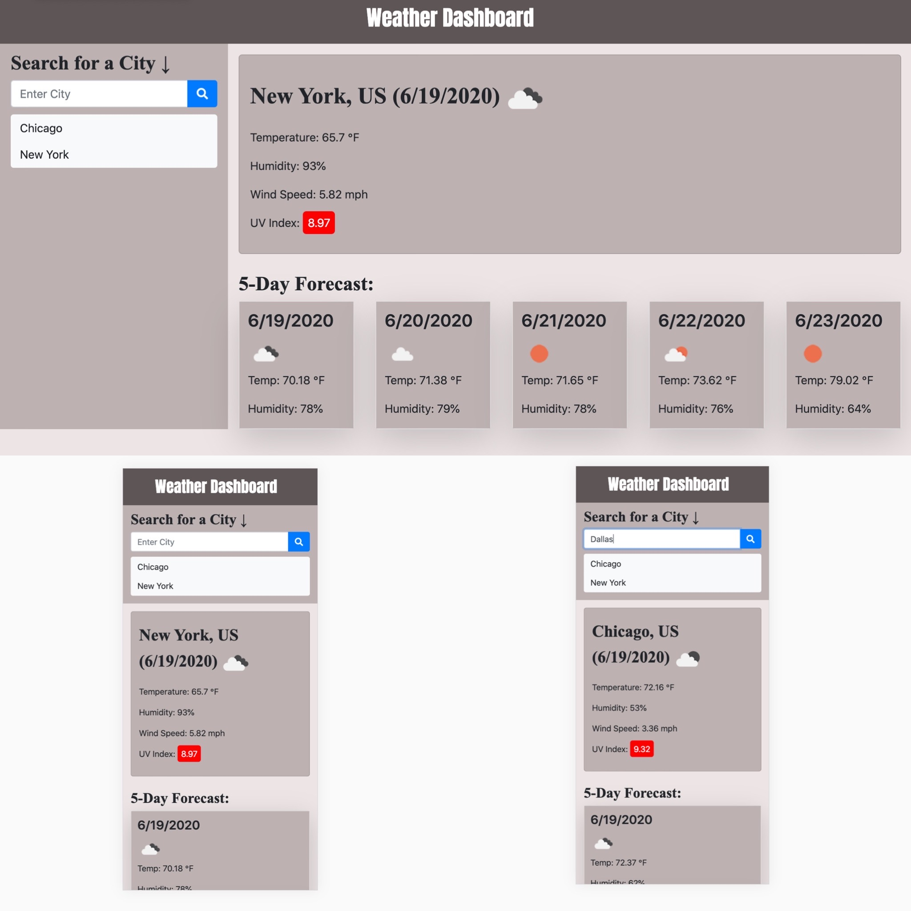

# Weather Dashboard

*Created a weather dashboard application using html, css, bootstrap, and powerd by javascript and jQuery. A third-party API from (https://openweathermap.org/api) was use to retrieve weather data for user inputed cities. This app will run in the browser and feature a clean, polished, responsive user interface. Ensuring that it adapts to multiple screen sizes.

*On this application, users input any city in search box located in the left side aisle to get the current weather and 5 day forecast results. Each inputed city will be saved to local storage and display in the history below the search box. 

Application Link: https://mansa-md.github.io/Weather_Dashboard/

*Application Desktop/Mobile Image: 

